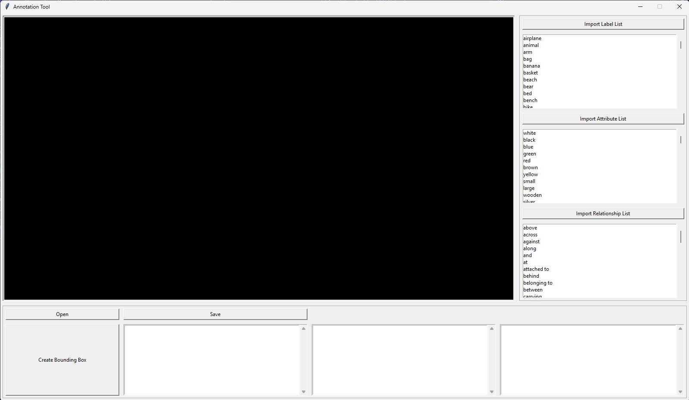

# **SGDET-Annotate**
> _Scene Graph Annotation Made Simple_

## **Introduction**
**SGDET-Annotate** is a user-friendly toolkit for creating bounding boxes, labeling objects, adding attributes, and defining relationships between bounding boxes in images. By enabling you to rapidly build structured datasets, **SGDET-Annotate** streamlines the process of preparing training data for Scene Graph Detection (SGDET).

## **Part 1: Installation**
Make sure you have Python 3.10 or higher installed.

1. **Clone the Repository** 
```bash 
git clone https://github.com/harvey-ph/SGDET-Annotate
```
2. **Navigate to the Project Directory**
```bash 
cd SGDET-Annotate
```
3. **Create and Activate a Virtual Environment**
```bash 
python -m venv venv
```
- For Windows user:
```bash 
source venv/Scripts/activate
```
- For Linux user:
```bash 
source venv/bin/activate
```
4. **Install Required Dependencies**
```bash 
pip install -r requirements.txt
```
5. **Start the Tool**
```bash
python main.py
```

## **Part 2: Open and Prepare for Bounding Box Creation**



1. **First-time Setup**  
   - Click **Import Label List**, **Import Attribute List**, and **Import Relationship List** on the right side of the tool to load your predefined lists.
   - The data in these lists then are matched to integer IDs for future data storage, so it’s important that you’ve decided on a unified set of labels, attributes, and relationships before you start annotating.  
   - **Tip:** Once you’ve imported the lists the first time, the tool will automatically load them on subsequent runs, so you won’t need to re-import unless you change the lists.
   - **Supported File Formats:** The import files must have a `.txt` extension. You can see the examples in the **importing_examples** folder for reference.

2. **Open an Image**  
   - Click the **Open** button and select the image you want to annotate.
   - Supported image formats include `.png`, `.jpg`, `.jpeg`, `.bmp`, and `.gif`.
   - The image will then appear in the main viewer area.

3. **Start Bounding Box Creation**  
   - Click the **Create Bounding Box** button to enter bounding box creation mode (the button will turn blue).
   - When you move your cursor over the image view area, it will switch to a crosshair.

4. **Draw the Bounding Box**  
   - Left-click and hold the mouse at your desired starting point on the image.
   - Drag the mouse to create a red rectangle around the object.
   - Release the mouse button once you’ve enclosed the object.
   - You’ll see a **dashed bounding box** with **blue dots** (anchor points) at the edges and corners. You can click and drag these points to **resize** or **realign** the bounding box before labeling it.  
   - Note that the bounding box will only be limited to the border of the image and you cannot click outside the image to start creating a new bounding box.

5. **Label the Bounding Box**  
   - Locate the appropriate label in the **Label List** you imported earlier and double-click on it.
   - Click **OK** on the confirmation panel that appears.
   - The bounding box is now successfully created and will be displayed as something like `bed:1`, where `1` is an internal ID distinguishing it from other bounding boxes of the same label.  
   > **Note:** This numeric suffix (e.g., `:1`) is only for internal reference and will _not_ be saved to the final dataset.

6. **Editing or Removing a Bounding Box**  
   - **Exit Bounding Box Creation Mode:**  
     Click the **Create Bounding Box** button again (it will return to its original white color).
   - **Delete an Unsatisfactory Box:**  
     1. Click on the bounding box you want to delete (it turns blue).  
     2. Right-click on image view area and select **Remove bounding box**, then confirm.  
     3. Any attributes or relationships assigned to this bounding box will also be deleted.
   - **Change the Label of a Created Box:**  
     1. Select the bounding box (it turns blue), then right-click on the image view area and choose **Change Label**.  
     2. The bounding box will flash; double-click the new label from the label list.  
     3. Click **OK** in the confirmation message.  
     4. The bounding box is now reassigned to the new label, and its relationships are automatically updated to reflect this change.

> **Tip:** If you accidentally create an unwanted bounding box during **Create Bounding Box** mode, just assign any label to it (so it’s recognized by the system). Then:
> 1. Click the **Create Bounding Box** button again to exit bounding box creation mode.
> 2. Select the unwanted bounding box (it will turn blue).
> 3. Right-click and choose **Remove bounding box**, then confirm to delete it.

## **Part 3: Create & Manage Attributes**

> **Important:** Make sure the **Create Bounding Box** button is _inactive_ (white background) before proceeding.

1. **Select the Target Object**  
   - **From the Image Viewer:**  
     - Click on the bounding box of the desired object (it will turn **blue**).  
   - **From the Bounding Box List (bottom row, first list box):**  
     - Click on the entry corresponding to the bounding box you want to modify.  
     - The bounding box will turn **blue** in the image viewer.

2. **Add an Attribute**  
   1. Right-click on the selected bounding box in the image view and choose **Add Attribute**.  
   2. Double-click the desired attribute in the imported Attributes List.  
   3. In the confirmation pop-up, click **OK**.  
   4. If you want to add another attribute, click **Yes** in the subsequent prompt; otherwise, click **No**.  
   - Each object can have up to **10 attributes**, and duplicate attributes are not allowed.

3. **Switching Between Objects**  
   - To **deselect** the current bounding box, click on it again. The bounding box border will switch from **blue** to **red**, indicating that it’s no longer selected.  
   - You can now select a different bounding box (which will turn **blue**).  
   - Alternatively, you can directly click on another object in the bounding box list, which will automatically deselect the previous one.

4. **Remove an Attribute**  
   1. Select the object whose attribute you want to remove.  
   2. In the **Attributes List** (bottom row, second list box), select the attribute to delete.  
   3. Right-click and choose **Remove Attribute**.  
   4. Click **Yes** in the confirmation message.  
   - The attribute will be removed, and the object’s attributes will update accordingly.


## **Part 4: Create & Manage Relationships**

1. **Select the Source Object**  
   - Click on the bounding box (it will turn **blue**) for the object you want to use as the **source** of the relationship.

2. **Add a Relationship**  
   - Right-click on the image view area and select **Add Relationship**.  
   - After reading the on-screen instructions, click **OK**.  
   - From the **Relationship List** (the imported list of possible relationships), **double-click** the desired relationship type.  
   - Next, select the **target object** by clicking on its bounding box area.  
   - Click **Yes** in the confirmation message to finalize the relationship.

   > **Example:** If you choose “dog:1” as the source object and “beside” as the relationship type, and then select “cat:2” as the target object, you’ll see the relationship displayed as:  
   **`dog:1 --- beside --- cat:2`**

3. **View Source-Specific Relationships**  
   - If you have a bounding box selected, the Relationship List (bottom row, **third list box**) will only display relationships where that bounding box is the source. This makes it easier to track and manage relationships for each object.

4. **Remove a Relationship**  
   - In the **Relationship List**, click on the relationship you want to delete.  
   - Right-click and select **Remove Relationship**.  
   - Click **Yes** in the confirmation dialog.  
   - The relationship will then be successfully removed.

## ** Part 5: Saving Annotated Data and Data Format**

## **Saving Your Annotations**

- **Save the Data**  
  Click the **Save** button to write your annotations (in both JSON and HDF5 formats) to the **output** folder.  
  > **Important:** Ensure you’ve fully completed annotation for the **current image** before switching to a new one. Once a new image is opened, any unsaved data from the previous image will be lost.

- **Editing Previously Annotated Images**  
  - Reopening a previously saved image will not currently display its existing bounding boxes, labels, attributes, or relationships (this feature is planned for a future release), even if you save it, you will have to do everything for the photo again from scratch.
  - Therefore, double-check your annotations and make all necessary edits before moving on to another image.

- **Data Format**

**SGDET-Annotate** automatically saves annotations in both **JSON** and **HDF5** (`.h5`) formats, following a structure inspired by [Visual Genome](https://homes.cs.washington.edu/~ranjay/visualgenome/index.html). This setup makes it easy to use the annotated dataset for training Scene Graph Generation (SGG) models. You can map numerical values to their corresponding text labels, attributes and relationship names using the files generated with related names in the **output** folder.

---

### **JSON Format**

A single annotated image in the JSON format might look like this:

```json
{
  "image-name": "images_example\\100.jpg",
  "width": 350,
  "height": 466,
  "attribute": [
    [3, 2, 15, 0, 0, 0, 0, 0, 0, 0],
    [11, 7, 0, 0, 0, 0, 0, 0, 0, 0],
    [9, 0, 0, 0, 0, 0, 0, 0, 0, 0]
  ],
  "boxes_1024": [
    [379, 330, 546, 548],
    [185, 786, 368, 458],
    [534, 640, 233, 156]
  ],
  "boxes_512": [
    [189, 165, 273, 274],
    [92, 393, 184, 229],
    [267, 320, 116, 78]
  ],
  "labels": [1, 3, 8],
  "relationships": [
    [0, 2],
    [2, 1]
  ],
  "predicates": [3, 8]
}

```
- **image-name**: Path to the original image file.  
- **width / height**: Original dimensions of the image.  
- **attribute**: A 2D array where each row corresponds to an object’s attributes. Each row can contain up to **10** attribute IDs (0 is used where no additional attributes exist).  
- **boxes_1024 / boxes_512**: Each bounding box is stored as `[x_center, y_center, width, height]`, after resizing the image so its longest side is either **1024px** or **512px**.  
- **labels**: An array of label IDs for the objects, matching the imported labels (see the corresponding file in the output folder).  
- **relationships**: A list of `[source_obj_index, target_obj_index]` pairs indicating which objects are related.  
- **predicates**: A list of relationship IDs that correspond one-to-one with entries in the `relationships` array.

> **Indexing Note:** Each object’s properties (label, box, attribute) share the same index across all arrays. For example, `labels[0]`, `boxes_512[0]`, `boxes_1024[0]`, and `attribute[0]` all refer to the **same object**.

---

### **HDF5 (.h5) Format**

- **image-name**, **width**, and **height** are stored as **HDF5 attributes**.
- Arrays such as **boxes_512**, **boxes_1024**, **labels**, **attribute**, **relationships**, and **predicates** are stored as **datasets** (key-value pairs), typically in `numpy.ndarray` format with `dtype=np.int32`.

---

## **Feedback & Issues**

If you encounter any errors or difficulties:
1. Go to the **[Issues](https://github.com/harvey-ph/SGDET-Annotate/issues)** section of this repository.
2. Submit a request describing the problem.

I’ll do my best to address it as soon as possible.  
**Thank you for using SGDET-Annotate!**